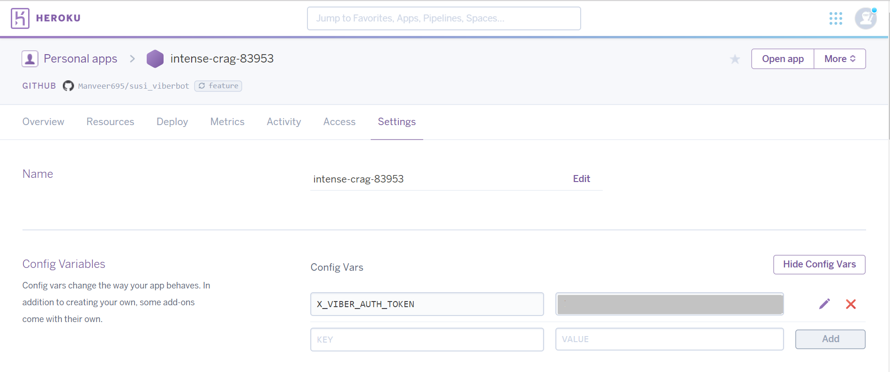

# Getting Started : Viber Susi AI Bot Installation 

It's easy for you to create your own Viber messenger bot and integrate susi's API into it. You can read the [documentation](https://support.viber.com/customer/en/portal/articles/2554141-create-a-public-account?b_id=13518) on how to make a public account in Viber and get started.

Messenger bots uses a web server to process messages it receives or to figure out what messages to send.

## Prerequisites
To create your account on -:
1. Viber
2. Github
3. Heroku

## Setup your own Messenger Bot
1. Fork this repository.

2. Request for a public account on Viber.

 [Fill this form](https://support.viber.com/customer/widget/emails/new?interaction_name=NEWEA)
 
 
 
 Follow the instructions for verification as indicated by viber.
 
 3. After verification, create and setup the public account.
 
 Click Second button from top-right, to discover public accounts made by you.
 
 

 Click blue button at bottom-right, to create a new one.
 
 
 
 Click Join Now to start setting it up.
 
 
 
 After filling the required details click Continue
 
 
 
 Add more specific details.
 
 
 
 Select Viber chat Api as your chat Solution.
 
 
 
 Copy the public account key. (It will be in the area that is coloured gray).
 
 
 
4. Create a new heroku app [here](https://dashboard.heroku.com/new?org=personal-apps).

 This app will accept the requests from Viber and Susi api.
 
 

5. Create a config variable by switching to settings page of your app. The name of your config variable should be X_VIBER_AUTH_TOKEN 
   and its value is the API key generated in step 3.

   

6. Change the url in set webhook request options that is on line 33 in index.js file to https://YOUR-HEROKU-APP-NAME.herokuapp.com enclosed in ' '. Commit and push the changes to this forked repository.

7. Connect the heroku app to the forked repository.
 
 Connect the app to Github by selecting the name of this forked repository.
 

8. Deploy on development branch. If you intend to contribute, it is recommended to Enable Automatic Deploys.

 Branch Deployment.
 

 Successful Deployment.
 
 

9. Now, visit the created heroku app from a browser, and check if the status message received for set Webhook request is - ok. That means the webhook is successfully set. 

 This should be the output.
 
 

10. Go to the Viber public account created and click the symbol indicating 1-on-1 chat with Susi at your top right(second symbol).
  
 1-on-1 chat
 

11. Enjoy chatting with Susi.

 
